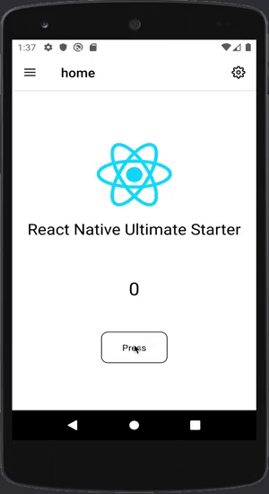
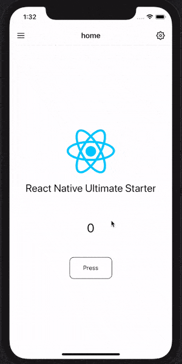

# React Native Ultimate Starter
>*<b>Note:</b> This starter is work in progress.*

Boost your app development and get your project up and running in no time.

## Features

*  <b>Typescript</b>
* State management: <b>redux</b>, <b>redux-toolkit</b>, <b>redux-persist</b>
* Navigation: <b>React Navigation v5</b> with stack and drawer showcased.
* <b>Dynamic theme</b> (dark & light)
* Powered with few custom components <b>Button</b>, <b>IconButton</b> with more coming on the way.
* Few <b>Utils</b> are provided. Eg. font, scale, shape, dimensions...etc.
* <b>react-native-localization</b>
* <b>react-native-easy-icon</b>

  
   

